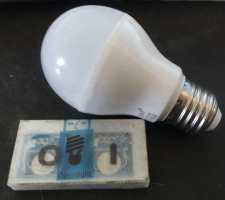
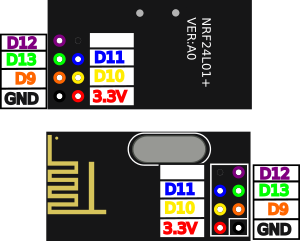
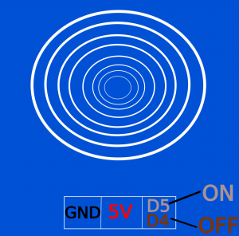

[English](https://madnerdorg.github.io/openlight/)

[](https://madnerdorg.github.io/libreconnect/doc/fr/devices)   
[Télécharger Openlight](https://github.com/madnerdorg/openlight/archive/master.zip) /  [LibreConnect](https://madnerdorg.github.io/libreconnect/) /[Source](https://github.com/madnerdorg/openlight)

- [C'est quoi OpenLight?](#cest-quoi-openlight)
- [Commandes](#commandes)
- [Applications](#applications)
- [Fabriquer openlight](#fabriquer-openlight)

# C'est quoi OpenLight?
     
Openlight est une alternative open source aux passerelles milight basé sur un arduino nano (clone).      
Fait à partir des recherches de Henryk Plötz : https://hackaday.io/project/5888-reverse-engineering-the-milight-on-air-protocol     

Les ampoules Milight ne sont pas contrôlées en WIFI, elles utilisent son propre protocole sur la fréquence **2.4Ghz**.    

     
Notre arduino va contrôler directement les ampoules milight grâce au module radio **nrf24l01+** sans **passer par la passerelle WIFI**.

Les boutons tactiles ne sont pas obligatoires, mais cela permet d'allumer et éteindre une lampe.         
Il faut ajouter les codes de la lampe dans votre code, la dernière valeur hexadécimale sera ignorée, car elle est mise à jour incrémentalement: 
```
int on [7] = { 0x00, 0x00, 0x00 ,0x00, 0x00, 0x00, 0x01};
int off [7] = { 0x00, 0x00, 0x00 ,0x00, 0x00, 0x00, 0x01};
```

# Commandes
/info : Affiche nom
```
/madnerdorg/openlight     
```
Quand un code est reçu il s'affiche 
```
0x00, 0x00, 0x00 ,0x00, 0x00, 0x00, 0x01
```
Entrer un code précédemment reçu pour l'envoyer 
```
0x00,0x00,0x00,0x00,0x01,0x03,0x00
``` 
# Fabriquer openlight
* Aller sur http://pdf.libre.ovh pour plus d'informations.
## Téléverser le code
* Copier **arduino/libraries** dans le carnet de croquis Arduino
* Téléverser **arduino/openlight_gateway/openlight_gateway.ino**

## Composants
* 1 Arduino nano (ch340g): 2.50€    
* 1 nrf24l01+ (radio module) : 1€    
* 2 Tactiles switchs : 2€   
> Total : 5.50€    

## Branchements
**Les modules nrf utilisent du 3.3V pas du 5V**





```
NRF
D9 : orange
D10 : jaune
D11 : bleu
D12 : violet
D13 : vert
3.3V: rouge

Boutons
D4 OFF SIG
D5 ON SIG
5V: VCC
```

# Licences

## openlight_gateway.ino
* Auteur : Rémi Sarrailh (madnerd.org)
* licence : MIT 

## openmili
* Auteur : Henryk Plötz
* licence : GPLv3
* Lien: [https://github.com/henryk/openmili](https://github.com/henryk/openmili)
 

