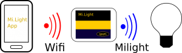
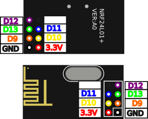

[Français](https://madnerdorg.github.io/openlight/readme.fr)

[](https://madnerdorg.github.io/libreconnect/doc/en/devices)   
[Download Openlight](https://github.com/madnerdorg/openlight/archive/master.zip) /  [LibreConnect](https://madnerdorg.github.io/libreconnect/) / [Source](https://github.com/madnerdorg/openlight)

- [What is OpenLight](#what-is-openlight)
- [Commands](#commands)
- [Applications](#applications)
- [How to build openlight](#how-to-build-openlight)

# What is OpenLight
     
Openlight is an open source alternative for milight gateway based on an arduino nano (clone).     
Based on Henryk Plötz research : [https://hackaday.io/project/5888-reverse-engineering-the-milight-on-air-protocol](https://hackaday.io/project/5888-reverse-engineering-the-milight-on-air-protocol)

Milight bulbs are not controlled using WIFI, it uses its own protocol on **2.4Ghz**.     
      
Our arduino will directly control the light bulbs using **nrf24l01+** radio modules without **using the WIFI gateway**.

Tactile switchs are not mandatory, you can use it to turn on/off a lamp.      
You need to add the code of your lamp in the code, last hexadecimal values will be ignored as it is updated incrementally:     
```
int on [7] = { 0x00, 0x00, 0x00 ,0x00, 0x00, 0x00, 0x01};
int off [7] = { 0x00, 0x00, 0x00 ,0x00, 0x00, 0x00, 0x01};
```
# Commands
/info : display name:port 
```
openlight:42003         
```
When a code is received it will be displayed as 
```
0x00, 0x00, 0x00 ,0x00, 0x00, 0x00, 0x01
```
Enter a previously received code to send it 
```
0x00,0x00,0x00,0x00,0x01,0x03,0x00
``` 

# Applications
[](https://www.youtube.com/watch?v=JnwSQTdr2jQ)

## Home Automation
[Home Automation Example](http://madnerd.org/interface/homeautomation)     

* Control milight lamps
* Build milight switch
* Detect if a lamp is turn on/off

# How to build openlight

## Upload
* Copy **arduino/libraries** into your arduino sketchbooks
* Upload **arduino/openlight/openlight.ino**
* Go to http://madnerd.org/interface/homeautomation
* Use your milight gateway to turn on/off lamps to retrieve the code into the interface.

## Components
* 1 Arduino nano (ch340g): 2.50€    
* 1 nrf24l01+ (radio module) : 1€    
* 2 Tactiles switchs : 2€   
> Cost : 5.50€    

## Wiring
**nrf modules use 3.3V not 5V**




```
NRF
D9 : orange
D10 : yellow
D11 : blue
D12 : purple
D13 : green
3.3V: red

SWITCHS
D4 OFF SIG
D5 ON SIG
5V: VCC
```

# Licences

## openlight.ino
* Author : Rémi Sarrailh (madnerd.org)
* Licence : MIT 

## openmili
* Author : Henryk Plötz
* Licence : GPLv3
* Link: [https://github.com/henryk/openmili](https://github.com/henryk/openmili)

